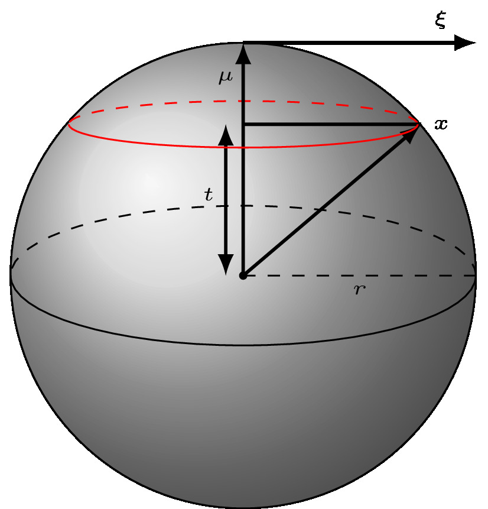
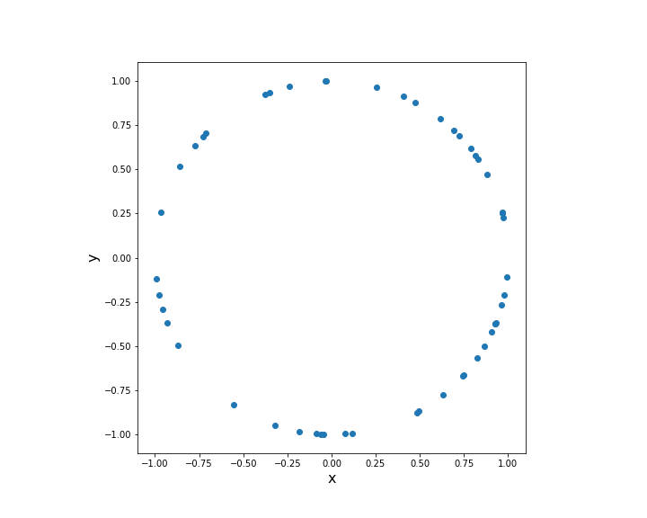
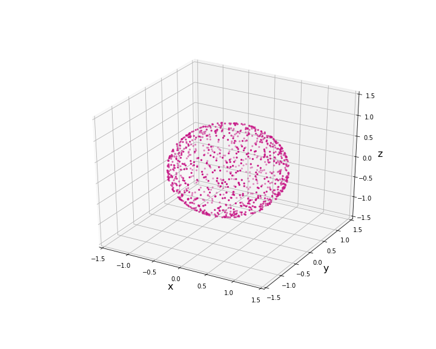
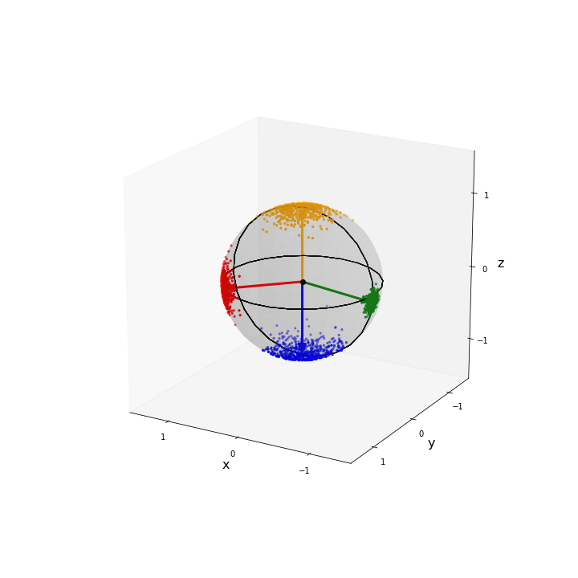

<!-- Title: DS-1: Sampling and visualising the von Mises-Fisher Distribution in $p$ dimensions
Date: 2020-06-05
Category: Tutorial
Tags: Circular statistics, Directional statistics, Sampling, Visualisation, von Mises-Fisher
Author: Daniel
Summary: In this tutorial we will discuss one of the most important distributions in directional  statistics. In particular, we show  how to sample one of the von Mises-Fisher distribution and how one can visualise the samples on the unit sphere. This distribution has applications in many different fields of study from astrophysics to paleomagnetism. -->

# DS-1: Sampling and visualising the von Mises-Fisher Distribution in $p$ dimensions


This is the second in a series of related blog posts/tutorials looking at directional statistics and machine learning. In this second post we will look at the von Mises-Fisher distribution. In particular, we will implement functions to calculate and sample from the von Mises-Fisher distribution [1]. Moreover, we will also implement a few functions to visualise spherical data.

In our previous post we looked at the von Mises distribution. In particular, we showed how one could sample from it and how one could visualise circular data. This distribution is available in the [scipy statistics package](https://docs.scipy.org/doc/scipy/reference/generated/scipy.stats.vonmises.html).  Numpy also has an implementation as well, which can be found [here](https://numpy.org/doc/1.16/reference/generated/numpy.random.vonmises.html). However, as we saw in the last post it is quite easy to write your own implementation (see Refs. [2,3]), which may be needed if you are working with a language other than  python. However, these libraries don’t implement many other functions related to field of directional statistics and this is something we will be looking at doing in this series. In fact, there isn't any
implementations for the von Mises-Fisher distribution, which is the focus of this tutorial.


## Introduction

The von Mises-Fisher distribution is the natural extension of the von Mises distribution on the unit circle $\mathbb{S}^{1}$ to the hypersphere $\mathbb{S}^{p-1}$. A unit hyper-sphere $\mathbb{S}^{p-1}$ can be considered
to be embedded in $p$-dimensional Euclidean space $\mathbb{R}^{p}$, e.g., the simplest example being the unit
circle which is denoted $\mathbb{S}^{1}$ and is embedded in $\mathbb{R}^{2}$. The next simplest example would
be the unit sphere denoted $\mathbb{S}^{2}$, embedded in $\mathbb{R}^{3}$ and so on.

If one considers the natural logarithm of the von Mises probability density function $p(\theta; \mu,\kappa)$,
then it becomes clear how it should be generalised to higher dimensions. As discussed in Ref. [1],
if one takes the natural logarithm of the von Mises distribution it is found to be linear in a unit random vector.
This is now demonstrated,

\begin{eqnarray*}
\log p(\theta; \mu,\kappa) & = & \kappa \cos (\theta - \mu) - \log I_{0}(\kappa) - \log 2\pi \\
& = & \kappa \boldsymbol{\mu}^{\top} \mathbf{x} - \log I_{0}(\kappa) - \log 2\pi \ ,
\end{eqnarray*}

where we have defined two unit vectors $\boldsymbol{\mu}$ and $\mathbf{x}$ such that

\begin{equation*}
\boldsymbol{\mu} = (\cos\mu,\sin\mu)^{\top} \quad , \quad \mathbf{x} = (\cos\theta,\sin\theta)^{\top}
\end{equation*}

and we have used the following trignometric identity

\begin{equation*}
\cos(A+B) = \cos A \cos B + \sin A \sin B \ .
\end{equation*}


From this we see that the appropriate generalisation to the ($p-1$)-dimensional hypersphere has a log density linear in $\mathbf{x}$. The $(p-1)$-dimension von Mises-Fisher probability density function for a unit random vector $\mathbf{x}\in \mathbb{S}^{p-1} \subset \mathbb{R}^{p}$ is

\begin{equation*}
f(\mathbf{x}; \boldsymbol{\mu},\kappa)
= \left( \frac{\kappa}{2} \right)^{p/2 - 1}
\frac{1}{\Gamma(p/2)I_{p/2 -1}(\kappa)} \exp \left(\kappa \boldsymbol{\mu}^{\top}\mathbf{x}\right)
\equiv C_{p}(\kappa) \exp \left(\kappa \boldsymbol{\mu}^{\top}\mathbf{x}\right)
\end{equation*}

where

- $\kappa\geq 0$ is the concentration
- $\boldsymbol{\mu}$ is the mean direction and is a unit vector ($\Vert \boldsymbol{\mu}\Vert = 1$)  
- $\mathbf{x}$ is the random unit vector
- $I_{\nu}(\kappa)$ is the modified Bessel function of the first kind of order $\nu = p/2 - 1$
- $C_{p}(\kappa)$ is the normalisation coefficient which can be shown to be dependent only on $\kappa$ and the dimension $p$

A few observations:

- the distribution is rotationally symmetric about $\boldsymbol{\mu}$
- If $O$ is an orthogonal transformation ($O^{\top}O = 1$), then
\begin{equation*}
f(O\mathbf{x}; O\boldsymbol{\mu},\kappa)
= C_{p}(\kappa) \exp \left(\kappa (O\boldsymbol{\mu})^{\top}(O\mathbf{x})\right)
= C_{p}(\kappa) \exp \left(\kappa \boldsymbol{\mu}^{\top}O^{\top}O\mathbf{x}\right)
= C_{p}(\kappa) \exp \left(\kappa \boldsymbol{\mu}^{\top}\mathbf{x}\right)
= f(\mathbf{x}; \boldsymbol{\mu},\kappa)
\end{equation*}

- A useful property is that under multiplication

\begin{equation*}
f(\mathbf{x}; \boldsymbol{\mu}_{1},\kappa_{1}) f(\mathbf{x}; \boldsymbol{\mu}_{2},\kappa_{2})  =f(\mathbf{x}; \boldsymbol{\mu},\kappa)
\end{equation*}
where
\begin{equation*}
\boldsymbol{\mu} = \frac{\kappa_{1}\boldsymbol{\mu}_{1} + \kappa_{2}\boldsymbol{\mu}_{2} }{\Vert \kappa_{1}\boldsymbol{\mu}_{1} + \kappa_{2}\boldsymbol{\mu}_{2} \Vert} \quad .
\end{equation*}

and
\begin{equation*}
\kappa = \Vert \kappa_{1}\boldsymbol{\mu}_{1} + \kappa_{2}\boldsymbol{\mu}_{2} \Vert
\end{equation*}

- as $\kappa\to \infty$ the clustering about the mean direction $\boldsymbol{\mu}$ increases


A few special cases:

- $\kappa=0$ it is the uniform distribution on the $(p-1)$-dimensional hypersphere

- In the case of the unit sphere the normalisation coefficient simplifies to
\begin{equation*}
C_{3}(\kappa) = \frac{\kappa}{\sinh\kappa}
\end{equation*}


The unit random vector $\mathbf{x}$ can be decomposed using a tangent-normal decomposition, i.e., components tangent to and perpendicular to the mean direction such that  

\begin{eqnarray*}
\mathbf{x}
& = & (\mathbf{x}\cdot \boldsymbol{\mu}) \boldsymbol{\mu} + (\mathbf{x} - (\mathbf{x}\cdot \boldsymbol{\mu}) \boldsymbol{\mu})\\
& = & t \boldsymbol{\mu} + (I_{p} - \boldsymbol{\mu}\boldsymbol{\mu}^{\top})\mathbf{x}\\
& = & t \boldsymbol{\mu} + \Vert (I_{p} - \boldsymbol{\mu}\boldsymbol{\mu}^{\top})\mathbf{x}\Vert \frac{(I_{p} - \boldsymbol{\mu}\boldsymbol{\mu}^{\top})\mathbf{x}}{\Vert (I_{p} - \boldsymbol{\mu}\boldsymbol{\mu}^{\top})\mathbf{x}\Vert}\\
& = & t \boldsymbol{\mu} + \sqrt{1-t^{2}} \boldsymbol{\xi} \quad ,
\end{eqnarray*}
where
- $t\equiv \mathbf{x}\cdot \boldsymbol{\mu}$,
- $I_{p}$ is the p-dimensional identity matrix,
- $\boldsymbol{\xi} = \frac{(I_{p} - \boldsymbol{\mu}\boldsymbol{\mu}^{\top})\mathbf{x}}{\Vert (I_{p} - \boldsymbol{\mu}\boldsymbol{\mu}^{\top})\mathbf{x}\Vert}$  such that $\boldsymbol{\xi}$ is normal to $\boldsymbol{\mu}$,
-  and we have used pythagorus' theorem ($a^{2} + b^{2} = c^{2}$)
\begin{equation*}
1= \Vert x \Vert^{2} = \Vert (I_{p} - \boldsymbol{\mu}\boldsymbol{\mu}^{\top})\mathbf{x}\Vert^{2} + \Vert t \boldsymbol{\mu}\Vert^{2}  =  \Vert I_{p} - \boldsymbol{\mu}\boldsymbol{\mu}^{\top}\Vert^{2}\Vert\mathbf{x}\Vert^{2} + t^{2} \Vert \boldsymbol{\mu}\Vert^{2}
=\Vert I_{p} - \boldsymbol{\mu}\boldsymbol{\mu}^{\top}\Vert^{2} + t^{2}\\
\end{equation*}
which leads us to
\begin{equation*}
\Vert I_{p} - \boldsymbol{\mu}\boldsymbol{\mu}^{\top}\Vert = \sqrt{1-t^{2}} \quad .
\end{equation*}


In the tangent-normal decomposition we see that $t$ is invariant under rotation about $\boldsymbol{\mu}$, because
it is parallel to $\boldsymbol{\mu}$, while $\boldsymbol{\xi}$ transforms as $\boldsymbol{\xi}\mapsto O\boldsymbol{\xi}$. Thus the conditional distribution of $\boldsymbol{\xi}\vert t$ is uniform on $\mathbb{S}^{p-2}$ [1]. It therefore follows that [1]

- $\boldsymbol{\xi}$ and $t$ are independent  
- $\boldsymbol{\xi}$ is uniform on $\mathbb{S}^{p-2}$

To visualise what is happening here. Consider the following diagram for the dimension $p=3$.



<!-- <center>

</center> -->


It can be seen that a rotation of $\mathbf{x}$ about $\boldsymbol{\mu}$ decomposed into components parallel
and perpendicular to $\boldsymbol{\mu}$ results in no change in $t$, however, the vector $\boldsymbol{\xi}$
sweeps out a unit circle ($\mathbb{S}^{p-2} = \mathbb{S}^{3-2} = \mathbb{S}^{1}$).

## Simulation

Ulrich in 1984 [2] gave an algorithm to sample the von Mises-Fisher distribution, which was later improved upon
by Wood in 1994 [3]. From the above considerations it is obvious that a von Mises-Fisher sample can be simulated by

- generating $\boldsymbol{\xi}$ from the uniform distribution on $\mathbb{S}^{p-2}$
- generating $t$ on the interval $[-1,1]$ from the marginal distribution, which can be shown to be [1]

\begin{equation*}
\left(\frac{\kappa}{2} \right)^{p/2 -1}
\frac{1}{\Gamma(\frac{p-1}{2})\Gamma(\frac{1}{2}) I_{\frac{p-1}{2}}(\kappa)}
e^{\kappa t} (1-t^{2})^{\frac{p-3}{2}}
\end{equation*}

- and then combining them using $\mathbf{x} = t \boldsymbol{\mu} + \sqrt{1-t^{2}} \boldsymbol{\xi}$ to produce pseudo-random unit vectors with a von Mises-Fisher distribution

Sampling the uniform distribution on a unit hyper-sphere is relatively simple and can be done a number of different
ways [4]. We will use an algorithm proposed by Muller in 1959 [5]. This algorithm requires sampling of the
normal distribution in the appropriate dimension ($(p,1)$ for one sample) and creating a unit vector out of these samples.


To sample the marginal distribution of $t$ we will follow the Ulrich [2] and Wood [3] and use rejection sampling. We will simply state the algorithm we will use to sample the von Mises-Fisher distribution and refer the interested
reader to [2], [3], and [6] for the further details regarding the derivation of the algorithm.

To simplify the algorithm we will simulate the von Mises-Fisher samples for a chosen $\kappa$ and the mean direction
$\boldsymbol{\mu} = [ 1 0 0 0 \ldots 0 ]^{\top}$. Afterwhich, we will then rotate to the desired $\boldsymbol{\mu}$.


### Algorithm

1. $p \leftarrow$ length of $\boldsymbol{\mu}$

2. Sample the $t$ marginal distribution

    1. $b \leftarrow \frac{(p-1)}{2\kappa + \sqrt{4\kappa^{2} + (p-1)^{2}}}$

    2. $x_{0} \leftarrow \frac{1-b}{1+b}$

    3. $c \leftarrow \kappa x_{0} + (p-1) \log(1-x_{0}^{2})$

    4. for i = 1 to N  // Rejection sampling for $N$ samples.

        - while $\kappa W + (p-1) \log(1-x_{0} W) - c < \log(U)$

            - $Z \leftarrow$ sample Beta distribution $B(\frac{p-1}{2},\frac{p-1}{2})$

            - $U \leftarrow$ sample the uniform distribution on $[0,1]$

            - $W \leftarrow \frac{1- (1+b)Z}{1- (1-b)Z}$

3. $\boldsymbol{\xi} \leftarrow$ sample uniform distribution on the sphere $\mathbb{S}^{p-2}$

    1. $s \leftarrow$ sample the standard normal distribution returning an array of shape $(N,p)$

    2. $\boldsymbol{\xi} \leftarrow$ normalised s such that $\boldsymbol{\xi}(i,:) = s(i,:) / \Vert s(i,:) \Vert$

4. $\textrm{Samples}(:,0) = t$  // Component parallel to the mean direction $\boldsymbol{\mu} = [ 1 0 0 0 \ldots 0 ]^{\top}$

5. $\textrm{Samples}(:,1:) = \sqrt{1- t^{2}}$ // Components orthogonal to the mean direction $\boldsymbol{\mu} = [ 1 0 0 0 \ldots 0 ]^{\top}$

6. We now have $N$ samples from the von Mises-Fisher distribution with  mean direction $\boldsymbol{\mu} = [ 1 0 0 0 \ldots 0 ]^{\top}$ and concentration $\kappa$. All that remains is to rotate each sample to the desired mean direction.

## Implementation

### Sampling the uniform distribution on a $p$-dimensional hyper-sphere

```python
def rand_uniform_hypersphere(N,p):

    """
        rand_uniform_hypersphere(N,p)
        =============================

        Generate random samples from the uniform distribution on the (p-1)-dimensional
        hypersphere $\mathbb{S}^{p-1} \subset \mathbb{R}^{p}$. We use the method by
        Muller [1], see also Ref. [2] for other methods.

        INPUT:  

            * N (int) - Number of samples
            * p (int) - The dimension of the generated samples on the (p-1)-dimensional hypersphere.
                - p = 2 for the unit circle $\mathbb{S}^{1}$
                - p = 3 for the unit sphere $\mathbb{S}^{2}$
            Note that the (p-1)-dimensional hypersphere $\mathbb{S}^{p-1} \subset \mathbb{R}^{p}$ and the
            samples are unit vectors in $\mathbb{R}^{p}$ that lie on the sphere $\mathbb{S}^{p-1}$.

    References:

    [1] Muller, M. E. "A Note on a Method for Generating Points Uniformly on N-Dimensional Spheres."
    Comm. Assoc. Comput. Mach. 2, 19-20, Apr. 1959.

    [2] https://mathworld.wolfram.com/SpherePointPicking.html

    """

    if (p<=0) or (type(p) is not int):
        raise Exception("p must be a positive integer.")

    # Check N>0 and is an int
    if (N<=0) or (type(N) is not int):
        raise Exception("N must be a non-zero positive integer.")

    v = np.random.normal(0,1,(N,p))

    v = np.divide(v,np.linalg.norm(v,axis=1,keepdims=True))

    return v
```


#### Consider the special case of the unit circle ( $p=2$ )

Generate 50 samples of the uniform distribution on the unit circle.

```python
data = rand_uniform_hypersphere(N=50,p=2)
```

<!-- <center>

</center> -->


#### Consider the case of unit sphere ( $p=3$ )

Generate 1000 samples of the uniform distribution on the unit sphere.

```python
data3D = rand_uniform_hypersphere(N=1000,p=3)
```

<!-- <center>

</center> -->


### Sampling the marginal distribution of $t$ using rejections sampling

As mentioned above we use rejection sampling to sample the marginal distribution.

```python
def rand_t_marginal(kappa,p,N=1):
    """
        rand_t_marginal(kappa,p,N=1)
        ============================

        Samples the marginal distribution of t using rejection sampling of Wood [3].

        INPUT:

            * kappa (float) - concentration        
            * p (int) - The dimension of the generated samples on the (p-1)-dimensional hypersphere.
                - p = 2 for the unit circle $\mathbb{S}^{1}$
                - p = 3 for the unit sphere $\mathbb{S}^{2}$
            Note that the (p-1)-dimensional hypersphere $\mathbb{S}^{p-1} \subset \mathbb{R}^{p}$ and the
            samples are unit vectors in $\mathbb{R}^{p}$ that lie on the sphere $\mathbb{S}^{p-1}$.
            * N (int) - number of samples

        OUTPUT:

            * samples (array of floats of shape (N,1)) - samples of the marginal distribution of t
    """

    # Check kappa >= 0 is numeric
    if (kappa < 0) or ((type(kappa) is not float) and (type(kappa) is not int)):
        raise Exception("kappa must be a non-negative number.")

    if (p<=0) or (type(p) is not int):
        raise Exception("p must be a positive integer.")

    # Check N>0 and is an int
    if (N<=0) or (type(N) is not int):
        raise Exception("N must be a non-zero positive integer.")


    # Start of algorithm
    b = (p - 1.0) / (2.0 * kappa + np.sqrt(4.0 * kappa**2 + (p - 1.0)**2 ))    
    x0 = (1.0 - b) / (1.0 + b)
    c = kappa * x0 + (p - 1.0) * np.log(1.0 - x0**2)

    samples = np.zeros((N,1))

    # Loop over number of samples
    for i in range(N):

        # Continue unil you have an acceptable sample
        while True:

            # Sample Beta distribution
            Z = np.random.beta( (p - 1.0)/2.0, (p - 1.0)/2.0 )

            # Sample Uniform distribution
            U = np.random.uniform(low=0.0,high=1.0)

            # W is essentially t
            W = (1.0 - (1.0 + b) * Z) / (1.0 - (1.0 - b) * Z)

            # Check whether to accept or reject
            if kappa * W + (p - 1.0)*np.log(1.0 - x0*W) - c >= np.log(U):

                # Accept sample
                samples[i] = W
                break

    return samples
```

Finally, we can put it all together to sample the von Mises-Fisher distribution.

```python
def rand_von_mises_fisher(mu,kappa,N=1):
    """
        rand_von_mises_fisher(mu,kappa,N=1)
        ===================================

        Samples the von Mises-Fisher distribution with mean direction mu and concentration kappa.

        INPUT:

            * mu (array of floats of shape (p,1)) - mean direction. This should be a unit vector.
            * kappa (float) - concentration.
            * N (int) - Number of samples.

        OUTPUT:

            * samples (array of floats of shape (N,p)) - samples of the von Mises-Fisher distribution
            with mean direction mu and concentration kappa.
    """


    # Check that mu is a unit vector
    eps = 10**(-8) # Precision
    norm_mu = np.linalg.norm(mu)
    if abs(norm_mu - 1.0) > eps:
        raise Exception("mu must be a unit vector.")

    # Check kappa >= 0 is numeric
    if (kappa < 0) or ((type(kappa) is not float) and (type(kappa) is not int)):
        raise Exception("kappa must be a non-negative number.")

    # Check N>0 and is an int
    if (N<=0) or (type(N) is not int):
        raise Exception("N must be a non-zero positive integer.")

    # Dimension p
    p = len(mu)

    # Make sure that mu has a shape of px1
    mu = np.reshape(mu,(p,1))

    # Array to store samples
    samples = np.zeros((N,p))

    #  Component in the direction of mu (Nx1)
    t = rand_t_marginal(kappa,p,N)

    # Component orthogonal to mu (Nx(p-1))
    xi = rand_uniform_hypersphere(N,p-1)

    # von-Mises-Fisher samples Nxp

    # Component in the direction of mu (Nx1).
    # Note that here we are choosing an
    # intermediate mu = [1, 0, 0, 0, ..., 0] later
    # we rotate to the desired mu below
    samples[:,[0]] = t

    # Component orthogonal to mu (Nx(p-1))
    samples[:,1:] = np.matlib.repmat(np.sqrt(1 - t**2), 1, p-1) * xi

    # Rotation of samples to desired mu
    O = null_space(mu.T)
    R = np.concatenate((mu,O),axis=1)
    samples = np.dot(R,samples.T).T

    return samples
```

#### Consider the case of unit sphere ( $p=3$ )

We now create four sets of samples with different mean direction and concentration.
Each set will have 500 samples. Note that we have normalised our mean direction vectors to be unit vectors. This normalisation is required by **rand_von_mises_fisher()**.

```python
# All sets have the same number of data points
Nsim = 500

# Set 1
mu1 = [1,1,0]
mu1 = mu1/np.linalg.norm(mu1)
kappa1 = 50
data1 = rand_von_mises_fisher(mu1,kappa=kappa1,N=Nsim)

# Set 2
mu2 = [0,0,1]
mu2 = mu2/np.linalg.norm(mu2)
kappa2 = 20
data2 = rand_von_mises_fisher(mu2,kappa=kappa2,N=Nsim)

# Set 3
mu3 = [0,0,-1]
mu3 = mu3/np.linalg.norm(mu3)
kappa3 = 20
data3 = rand_von_mises_fisher(mu3,kappa=kappa3,N=Nsim)

# Set 4
mu4 = [-10,0,-1]
mu4 = mu4/np.linalg.norm(mu4)
kappa4 = 200
data4 = rand_von_mises_fisher(mu4,kappa=kappa4,N=Nsim)
```

To visual this data we have written two functions to accomplish this. The main function
is **plot_3d_scatter()**, which is used to plot the 3D samples and a transparent sphere.
The second is **plot_arrow()** (see [associated repository](https://github.com/dlwhittenbury/von-Mises-Fisher-Sampling)) used to plot arrows in the mean direction of the samples.


```python
def plot_3d_scatter(data,ax=None,colour='red',sz=30,el=20,az=50,sph=True,sph_colour="gray",sph_alpha=0.03,
                    eq_line=True,pol_line=True,grd=False):
    """
        plot_3d_scatter()
        =================

        Plots 3D samples on the surface of a sphere.

        INPUT:

            * data (array of floats of shape (N,3)) - samples of a spherical distribution such as von Mises-Fisher.
            * ax (axes) - axes on which the plot is constructed.
            * colour (string) - colour of the scatter plot.
            * sz (float) - size of points.
            * el (float) - elevation angle of the plot.
            * az (float) - azimuthal angle of the plot.
            * sph (boolean) - whether or not to inclde a sphere.
            * sph_colour (string) - colour of the sphere if included.
            * sph_alpha (float) - the opacity/alpha value of the sphere.
            * eq_line (boolean) - whether or not to include an equatorial line.
            * pol_line (boolean) - whether or not to include a polar line.
            * grd (boolean) - whether or not to include a grid.

        OUTPUT:

            * ax (axes) - axes on which the plot is contructed.
            * Plot of 3D samples on the surface of a sphere.

    """


    # The polar axis
    if ax is None:
        ax = plt.axes(projection='3d')

    # Check that data is 3D (data should be Nx3)
    d = np.shape(data)[1]
    if d != 3:
        raise Exception("data should be of shape Nx3, i.e., each data point should be 3D.")

    ax.scatter(data[:,0],data[:,1],data[:,2],s=5,c=colour)
    ax.view_init(el, az)
    ax.set_xlim(-1.5,1.5)
    ax.set_ylim(-1.5,1.5)
    ax.set_zlim(-1.5,1.5)

    # Add a shaded unit sphere
    if sph:
        u, v = np.mgrid[0:2*np.pi:30j, 0:np.pi:30j]
        x = np.cos(u)*np.sin(v)
        y = np.sin(u)*np.sin(v)
        z = np.cos(v)
        ax.plot_surface(x, y, z, color=sph_colour,alpha=sph_alpha)

    # Add an equitorial line
    if eq_line:
        # t = theta, p = phi
        eqt = np.linspace(0,2*np.pi,50,endpoint=False)
        eqp = np.linspace(0,2*np.pi,50,endpoint=False)
        eqx = 2*np.sin(eqt)*np.cos(eqp)
        eqy = 2*np.sin(eqt)*np.sin(eqp) - 1
        eqz = np.zeros(50)

        # Equator line
        ax.plot(eqx,eqy,eqz,color="k",lw=1)

    # Add a polar line
    if pol_line:
        # t = theta, p = phi
        eqt = np.linspace(0,2*np.pi,50,endpoint=False)
        eqp = np.linspace(0,2*np.pi,50,endpoint=False)
        eqx = 2*np.sin(eqt)*np.cos(eqp)
        eqy = 2*np.sin(eqt)*np.sin(eqp) - 1
        eqz = np.zeros(50)

        # Polar line
        ax.plot(eqx,eqz,eqy,color="k",lw=1)

    # Draw a centre point
    ax.scatter([0], [0], [0], color="k", s=sz)    

    # Turn off grid
    ax.grid(grd)

    # Ticks
    ax.set_xticks([-1,0,1])
    ax.set_yticks([-1,0,1])
    ax.set_zticks([-1,0,1])

    return ax
```

Putting these together we visualise the four sets of samples. Note that the samples on the far side of the sphere are of a lighter shade to exhibit the fact they are on the other side of the sphere.

```python
fig = plt.figure(figsize=(10,10))
ax = plt.axes(projection='3d')

# Set 1
plot_3d_scatter(data1,ax)
plot_arrow(mu1,ax,colour="red")

# Set 2
plot_3d_scatter(data2,ax,colour='orange')
plot_arrow(mu2,ax,colour="orange")

# Set 3
plot_3d_scatter(data3,ax,colour='blue')
plot_arrow(mu3,ax,colour="blue")

# Set 4
plot_3d_scatter(data4,ax,colour='green')
plot_arrow(mu4,ax,colour="green")

# Labels
ax.set_xlabel('x',fontsize=fs)
ax.set_ylabel('y',fontsize=fs)
ax.set_zlabel('z',fontsize=fs)

# Viewing angle
ax.view_init(20,120)
```




<!-- <center>

</center> -->


If you want to make the 3D image interactive in the jupyter notebook, so you can rotate to a better angle. This is easily done by including the command

```python
%matplotlib notebook
```

before plotting the image. If you want to revert back, simply use
```python
%matplotlib inline
```


## Concluding remarks

The analysis of circular and more generally directional data is extremely important to many
fields of study, but it is rarely given the same amount of attention as statistics in
Euclidean spaces. This is the second in a series of tutorials looking at topics
in directional statistics and machine learning. Today we looked at one of the
most important hyper-spherical distributions which has many applications ranging from astrophysics to paleomagnetism. We presented how one might sample the von Mises-Fisher distribution. This is important because there are no implementations available in the usual python libraries. We also showed how one can visualise spherical data. In later tutorials we will consider other important directional distributions and machine learning algorithms which make use of them.

- Please note not all code is given in the blog article. For all code including
all supporting functions please see the [associated repository](https://github.com/dlwhittenbury/von-Mises-Fisher-Sampling).  

## References


[1] Mardia, K.V. and Jupp, P.E., Directional Statistics. John Wiley & Sons, London (2000).

[2] Ulrich, G., Computer Generation of Distributions on the $m$-sphere, Appl. Statist. 33, No. 2. pp. 158-163, (1984).

[3] Wood, A. T. A., Simulation of the von mises fisher distribution, Communications in Statistics - Simulation and Computation, 23 , 157-164 (1994).

[4]  <https://mathworld.wolfram.com/SpherePointPicking.html>

[5] Muller, M. E. "A Note on a Method for Generating Points Uniformly on N-Dimensional Spheres."
    Comm. Assoc. Comput. Mach. 2, 19-20, Apr. (1959).

[6] Hornik, Kurt and Grün, Bettina, movMF: An R Package for Fitting Mixtures of von Mises-Fisher Distributions, Journal of Statistical Software, 58 (10), pp. 1-31 (2014).

[7] Drawing a fancy vector see <https://stackoverflow.com/questions/11140163/plotting-a-3d-cube-a-sphere-and-a-vector-in-matplotlib>
