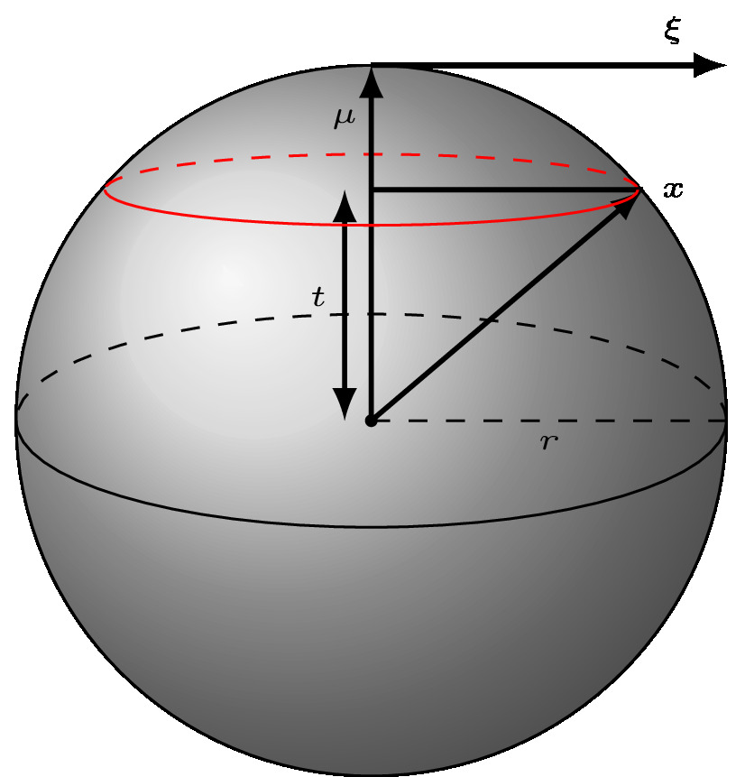
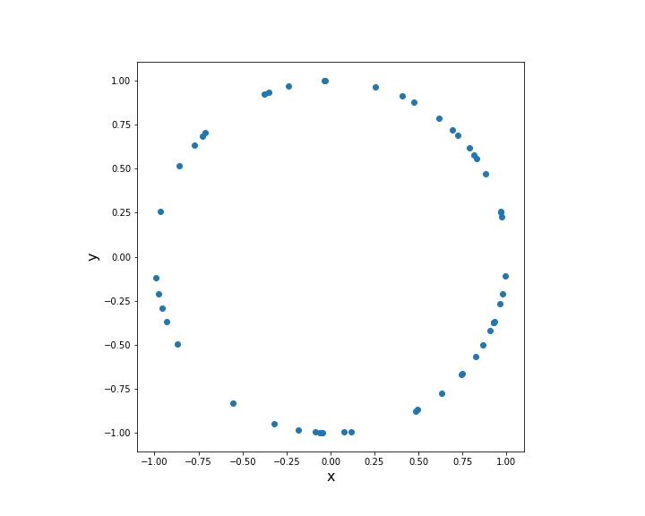
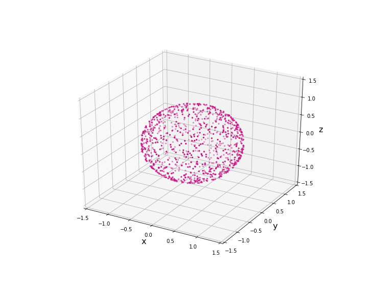
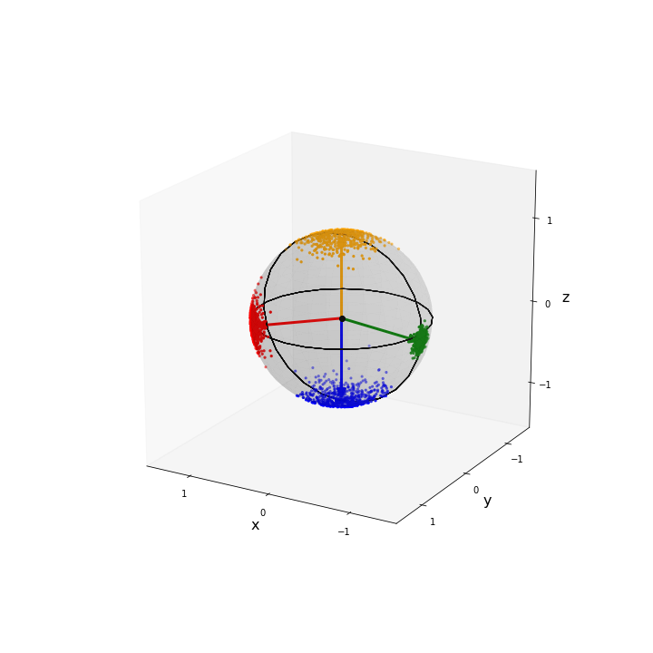

# Sampling and Visualising the von Mises-Fisher Distribution  

This repository is associated with the blog post/tutorial on my website which can be found [here](https://dlwhittenbury.github.io/ds-2-sampling-and-visualising-the-von-mises-fisher-distribution-in-p-dimensions.html).
This is the second in a series of related blog posts/tutorials looking at directional statistics and machine learning. In this second post we look at the von Mises-Fisher distribution. In particular, we implement functions to sample from the von Mises-Fisher distribution [1]. Moreover, we will also implement a few functions to visualise spherical data.

In our previous post we looked at the von Mises distribution. In particular, we showed how one could sample from it and how one could visualise circular data. This distribution is available in the scipy statistics package. Numpy also has an implementation as well, which can be found here. However, as we saw in the last post it is quite easy to write your own implementation (see Refs. [2,3]), which may be needed if you are working with a language other than python. However, these libraries don’t implement many other functions related to field of directional statistics and this is something we will be looking at doing in this series. In fact, there isn’t any implementations for the von Mises-Fisher distribution, which is the focus of this tutorial.

## A few visualisations

## References

1. Mardia, K.V. and Jupp, P.E., Directional Statistics. John Wiley & Sons, London (2000).
2. Ulrich, G., Computer Generation of Distributions on the m-sphere, Appl. Statist. 33, No. 2. pp. 158-163, (1984).
3. Wood, A. T. A., Simulation of the von Mises Fisher distribution, Communications in Statistics - Simulation and Computation, 23 , 157-164 (1994).
4.  <https://mathworld.wolfram.com/SpherePointPicking.html>
5. Muller, M. E. "A Note on a Method for Generating Points Uniformly on N-Dimensional Spheres."
    Comm. Assoc. Comput. Mach. 2, 19-20, Apr. (1959).
6. Hornik, Kurt and Grün, Bettina, movMF: An R Package for Fitting Mixtures of von Mises-Fisher Distributions, Journal of Statistical Software, 58 (10), pp. 1-31 (2014).
7. Drawing a fancy vector see <https://stackoverflow.com/questions/11140163/plotting-a-3d-cube-a-sphere-and-a-vector-in-matplotlib>
